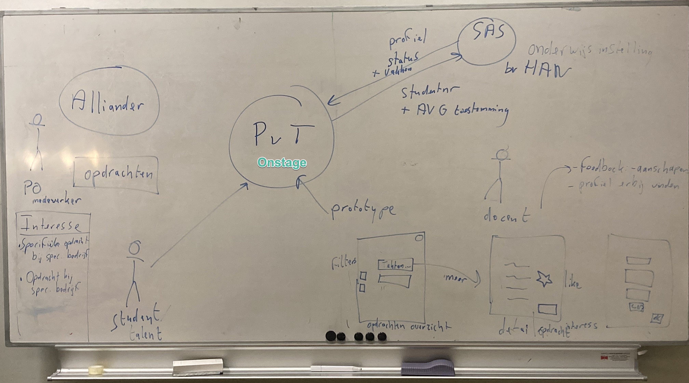
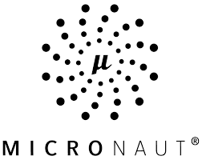
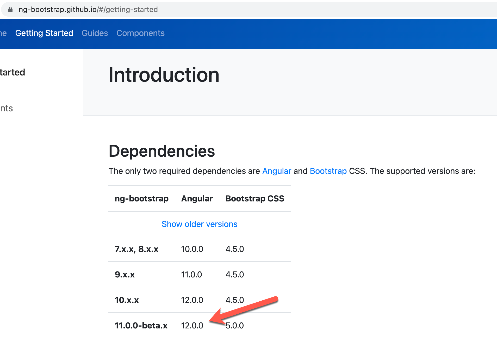
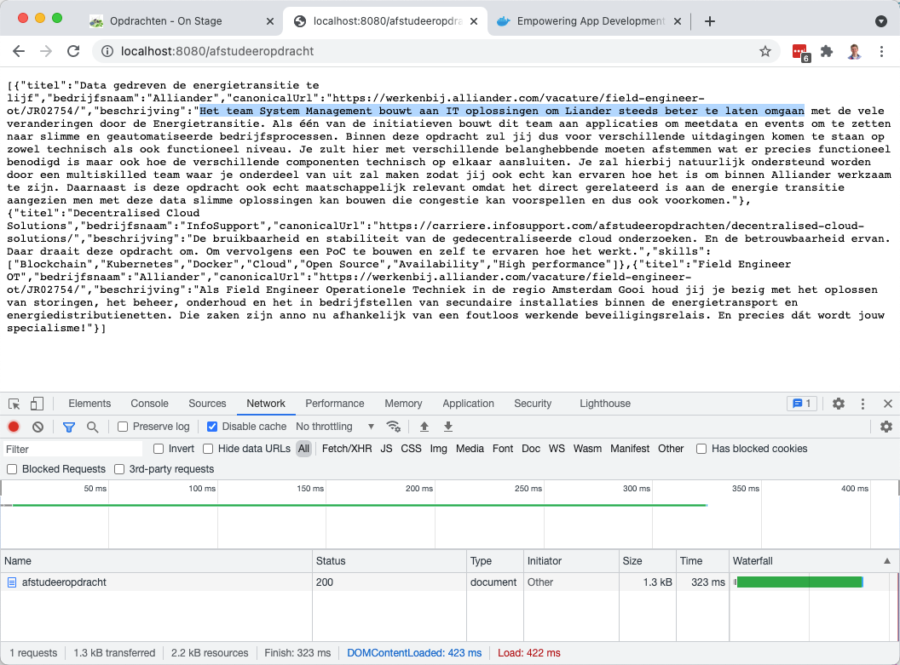

# OnStage

>*Een marktplaats voor jong talent*

## Do 18-11-2021

Welkom bij 'teh code' i.k.v. Alliander's Innovathon voor team 'Markplaats voor jong Talent'.

Prototype via [Adobe XD](https://xd.adobe.com/view/1ea849ef-3de6-4013-baff-971f09dc5d1c-4bfb/).

<figure><figcaption>Groen is de toekomst. De toekomst is groen! <span style="font-size: 8px;">(attributie: <a href="https://depositphotos.com/334720368/stock-photo-solar-panels-and-wind-turbine.html">depositphotos</a>)
</span></figcaption>
</figure>

## Software Architectuur

Onderstaande architectuur schets geeft aan dat het idee van *Marktplaats voor talent* meer is dan 'slechts een website-je'. Het is een echte webapplicatie en zelfs een set van (micro)services, zodat het echt eeen levendige hub wordt

- met beoogde white labeling
- verzamelen interessen, zowel voor specifieke opdracht bij specifiek bedrijf als een open sollicitatie met optioneel CV uploaden
- CV gegeven en andere prive student informatie alleen inzichtelijk voor medewerkers bedrijf (AVG)
- aansluiten andere groene partners
- tonen labels voor vereiste competenties, techieken en aangeboden stagevoorwaarden (minder tekst, meer plaatjes)
- login mogelijkheden (SSO) voor tonen alleen voor gebruiker elevante informatie,
- koppelen met Studenten Administratie Systeem (SAS) van onderwijsinstellingen waarmee Alliander samenwerkingsovereenkomst heeft
- evt uitwerken rol van docenten met feedback voor aanscherpen aangeleverde opdrachten,
- verzamelen en weergeven eerdere stage ervaringen en statistieken.


*Figuur 1*: Schets van de Software Architectuur

TODO: Verder uitwerken met bijvoorbeeld [C4](https://c4model.com/).

## Technologie

Deze site gebruikt:

- [Bootstrap 5 componenten](https://getbootstrap.com/docs/5.1/components)
- met CSS [flexbox shizzle 😉](https://javascript.plainenglish.io/bootstrap-5-flexbox-utilities-1ddfc6182c16)

Verder beoogde Technologie:

- [Micronaut](https://micronaut.io/) voor centrale REST API ('Java voor DevOps' volgens 12factor principles + evt. [Micronaut views](https://micronaut-projects.github.io/micronaut-views/latest/guide/) met dan denk liefst Mustache templates 🥸)

- [Wordpress](https://developer.wordpress.org/plugins/post-types/registering-custom-post-types/) (Jaja, the tech each true nerd loves to hate, maar een Wordpress plugin die shortcode beschikbaar stelt voor integreren opdrachten (opgeslagen in custom post type) is wel laagdrempelige instap)

- [Angular](https://angular.io/) en liefst Progressive Web App (PWA) (nieuwste Angular 13 werkt out-of-the box nog niet met [Bootstrap 5](https://ng-bootstrap.github.io/#/home) merkten we) ([of toch?](https://www.youtube.com/watch?v=AJ7iaPea0hE))

## Hoe zelf te runnen en verder te ontwikkelen

1. [Installeer git](https://git-scm.com/downloads) als je die nog niet had.

*Note to self: [Switch naar bash](https://www.howtogeek.com/444596/how-to-change-the-default-shell-to-bash-in-macos-catalina/) met `chsh -s /bin/bash` als je [zsh problemen]() hebt.)*

1. Clone deze repository

```bash
git clone https://github.com/bartvanderwal/on-stage
```

1. Ga naar `mvt.web`

1. Run front-end met `npx http-server .` (of eigen voorkeursserver als je NodeJS niet hebt en niet wilt [installeren](https://nodejs.org/en/download/))

1. Surf in je browser naar `http://localhost:80xx` met `xx` zoals run output aangaf.

1. Installeer Gradle package manager voor Java (JVM) applicaties (als je nog niet hent)

1. Run evt. de back-end/API applicatie via Gradlew (TODO: Front-end daar op aansluiten).
NB Zorg dat er geen (andere) applicatie op poort 8080 draait.

**Windows**

```cmd
./gradlew run
```

**macOS**

```bash
./gradlew run
```

1. Surf in je browser naar `http://localhost:8080/afstuderen` en check dat `JSON` output komt en correct is (zie voorbeeld in screenshot)



1. Zie dat het werkt (hopelijk, maak anders [issue](https://github.com/bartvanderwal/on-stage/issues) aan), open [VS Code][(](https://code.visualstudio.com/download)) en werk verder.
Check evt. verder de gevolgde [Micronaut docs (voor Java+Gradle)](https://guides.micronaut.io/latest/creating-your-first-micronaut-app-gradle-java.html)

1. Installeer [Docker Desktop](https://www.docker.com/products/docker-desktop) als je die niet hebt, en start evt. de Wordpress site op met:

```bash
cd mvt.wordpress
docker compose up
```

## TODO

- [ ] `mvt.api` hernoemen naar `onstage.api` en alle packages mee (beter nu dan later)
- [ ] Datamodel opstellen, API afmaken volgens specs en [unit tests](https://guides.micronaut.io/latest/creating-your-first-micronaut-app-gradle-java.html) schrijven
- [ ] Statische HTML ombouwen naar Angular componenten
- [ ] Dan met AJX tegen REST API praten vanuit Angular front-end (of indirect via Wordpress plugin (bedrijfsspecifieke opdrachten en studenten opslaan in custum post types)).
- [ ] En dan nog een heel aantal meer schermen en functionaliteit natuurlijk...
